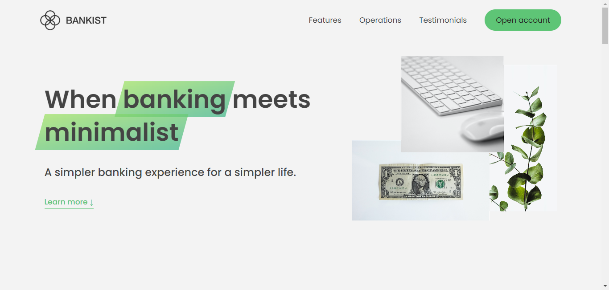

# Bankist-Landing-Page

## About

This is landing page for a frictional bank name Bankist.

**Special Thanks:** A heartfelt thanks to _Jonas Schmedtmann_ for his incredible guidance and expertise. His teachings have been instrumental in bringing this project to life.

## Tech & Tools

## Key Features

1. **Modal Window**: A pop-up window that enhances user interaction.
2. **Smooth Scrolling**: Implements smooth scrolling behavior using the `scrollIntoView()` method for better user experience.
3. **Tabbed Interface & Menu Hover**: Advanced tabbed navigation and dynamic menu hover effects powered by `event delegation`.
4. **Sticky Navigation & Lazy Loading**: Seamless sticky navigation bar and lazy loading of images or content using the `IntersectionObserver` API for improved performance.
5. **Slider Component**: An interactive slider for effortless content transitions, providing a visually engaging experience.

## Contact Me

## LISENSE

Copyright (c) 2024 Arpit Jana
